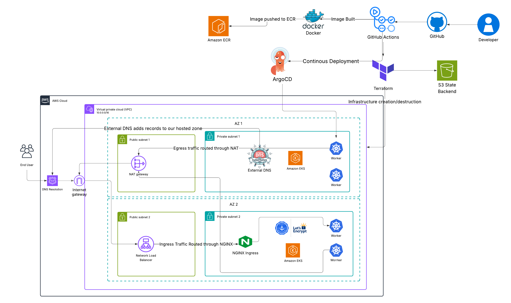

# EKS Deployment Using Argo CD, Helm and Terraform 🚀

Goal: Deploys a simple portfolio web application to an **Amazon EKS** cluster using **Terraform** for infrastructure, NGINX Ingress for traffic management, **GitHub Actions** and **Argo CD** for CI/CD, **Helm** for app & platform charts. 

--- 

## Contents

- [Architecture](#Architecture)
- [Project Structure](#project-structure)
- [Infrastructure Setup](#infrastructure-setup)
- [How It Works](#how-it-works)
- [Security Considerations](#security-considerations)
- [CI/CD](#CI-CD)
- [Cost Comparison](#Costs)
- [Troubeshooting](#Decisions)

---
## Architecture




---

## Project Structure

```
├── .github/workflows
│   ├── apply.yml
│   ├── build.yaml
│   └── destroy.yaml
├── app
│   ├── Dockerfile
│   ├── index.html
│   └── ys2025.pdf
├── argo-cd
│   ├── manifests
│   │   └── deployment.yaml
│   └── argo-cd.yaml
├── cert-man
│   └── issuer.yaml
├── images
│   ├── argoapp.gif
│   └── EKS-Project.png
├── terraform
│   ├── helm-values
│   │   ├── argo-helm.yaml
│   │   ├── cert-manager.yaml
│   │   └── external-dns.yaml
│   ├── scripts
│   │   └── cleanup.sh
│   ├── eks.tf
│   ├── helm.tf
│   ├── irsa.tf
│   ├── locals.tf
│   ├── Makefile
│   ├── providers.tf
│   └── vpc.tf
└── README.md
```

## Infrastructure Setup

- State backend: S3 (remote state) with native state locking as AWS moves to deprecate DynamoDB locking. 

- VPC: One nat gateway across 2 AZs for cost optimsation, single point of failure ignored for small project. Ingress traffic managed by NGINX controller, Outbound routed through NAT Gateway

- EKS: Private node subnets; public access for us to interact with cluster. IRSA enabled, Cluster Admin Permissions enabled.

- IRSA: Pods assume AWS roles via service account annotations without hardcoding AWS credentials 

- Helm: External-DNS creates the DNS record in Route 53. Cert-Manager requests a certificate via the ClusterIssuer from Let's Encrypt and attaches to ingress, pointing them at the clusters NLB. Nginx Ingress handles ingress traffic into the cluster to the service. 

- ArgoCD: Automated deployment of our application deployed from insde the cluster to sync manifests from GitHub 

- End to end flow: 
Route 53 resolves DNS requests, reaches IGW, forwards to NLB to NGINX Ingress controller to our service and lastly our pods. TLS is automatically applied by cert manager using Let's encrypt so our webpage is served over HTTPS. Egress traffic routed through NAT Gateway. 

## Security Considerations

- Scanning in CI before apply: Tflint and Checkov for IaC, Trivy for Docker image
- Rule of least privilege for IRSA roles
- All workflows use OIDC instead of GitHub secrets credentials: 

## CI-CD  

```
└── workflows
    ├── apply.yml
    ├── build.yaml
    └── destroy.yaml
```

App changes trigger the Docker workflow:
- Build image → scan with trivy → push to ECR 

Push to main triggers the Terraform workflow:
- IaC scans (tflint, tfsec, checkov) + trivy config scan
- Terraform init/plan/apply provisions and updates VPC, EKS, IRSA, Helm resources.

Terraform destroy:
- Destroy helm created resources first to ensure permissions error does not occur when destroying 
- Manual trigger to destroy infrastructure

Argo CD:
- Installs Argo CD
- Monitors our repo so future changes auto-sync
- Decodes password for us to access our setup 

## Cost Comparison

- EKS control plane hourly charge, node instances, data transfer, Elastic IPs/ALBs if used, Route 53 queries, DNS validation traffic and ECR storage.

- S3 + CloudFront is typically next to nothing for a small site.

## Troubleshooting

- Ingress not resolving: Check external-dns logs; verify hosted zone and domain filters match.

- Certificate pending: Check cert-manager challenges  and that Route 53 records exist; ensure IAM permissions via IRSA.

- Argo not syncing: Confirm repo URL, path and branch; check Argo Application status and events.

- kubectl auth issues: Confirm aws eks update-kubeconfig ran with the right cluster/region/role.
